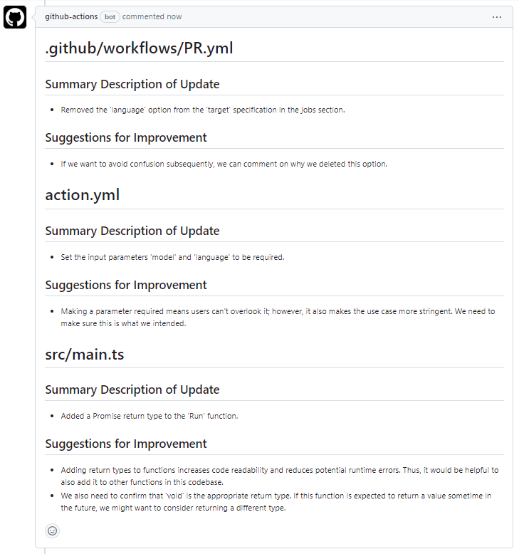
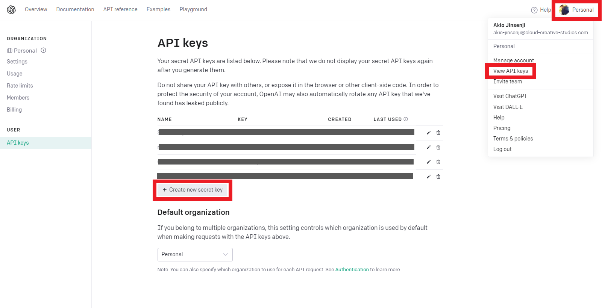
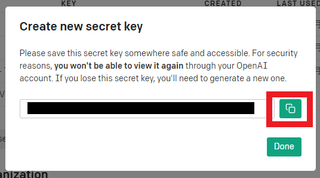

# auto-review-github-action

This action is to respond to a pull request with a summary of the pull request and suggestions for improvement.
This action requires an OpenAI API key.

A summary and suggestions for improvement will be posted in the pull request comments as follows



## Usage

```yml
- uses: akiojin/auto-review-github-action@v0.1.0
  if: github.event_name == 'pull_request'
  with:
    openai-api-key: ${{ secrets.OPENAI_API_KEY }}
    target: 'ts,yml'
```

In this example, the review is performed when there is an update to `*.ts` or `*.yml`.

You must also add `write` permission to `pull_requests` in your permission settings.

```yml
permissions:
  pull-requests: write
  ...
```

## Arguments

| Name               | Required | Type     | Default                                     | Description                                                                                                                        |
| ------------------ | -------- | -------- | ------------------------------------------- | ---------------------------------------------------------------------------------------------------------------------------------- |
| `openai-api-key`   | `true`   | `string` |                                             | Specify the API key for OpenAI.                                                                                                    |
| `model`            | `true`   | `string` | `gpt-3.5-turbo`                             | Specifies the ChatGPT model to be used. One of the following: `gpt-4`, `gpt-3.5`, `gpt-3.5-turbo`                                  |
| `base-sha`         | `true`   | `string` | `${{ github.event.pull_request.base.sha }}` | Specifies the SHA of the base commit. By default, `${{ github.event.pull_request.base.sha }}` is specified.                        |
| `github-token`     | `true`   | `string` | `${{ github.token }}`                       | Specify a GitHub token. By default, `${{ github.token }}` is specified.                                                            |
| `pull-request-url` | `true`   | `string` | `${{ github.event.pull_request.html_url }}` | Specify the URL of the pull request. By default, `${{ github.event.pull_request.html_url }}` is specified.                         |
| `target`           | `true`   | `string` |                                             | Specify the extension of the file to be reviewed. If there are multiple files, specify them separated by commas. ex) `'md,txt,ts'` |
| `language`         | `true`   | `string` | `English`                                   | Specify the language in which the comments will be written. This value should be specified in plain language. ex) 日本語              |

## How to create an API key for OpenAI

[OpenAI platform](https://platform.openai.com/)

View the list of API keys by clicking "Personal > View API keys" in the upper right corner of the above site.


Next, select "Create new secret key" to create a new API key.



Enter an appropriate name in "Name" and select "Create secret key" to create a key.


Copy the created API key.



Set the copied API key to secret with an easy-to-understand name such as `OPENAI_API_KEY`.
